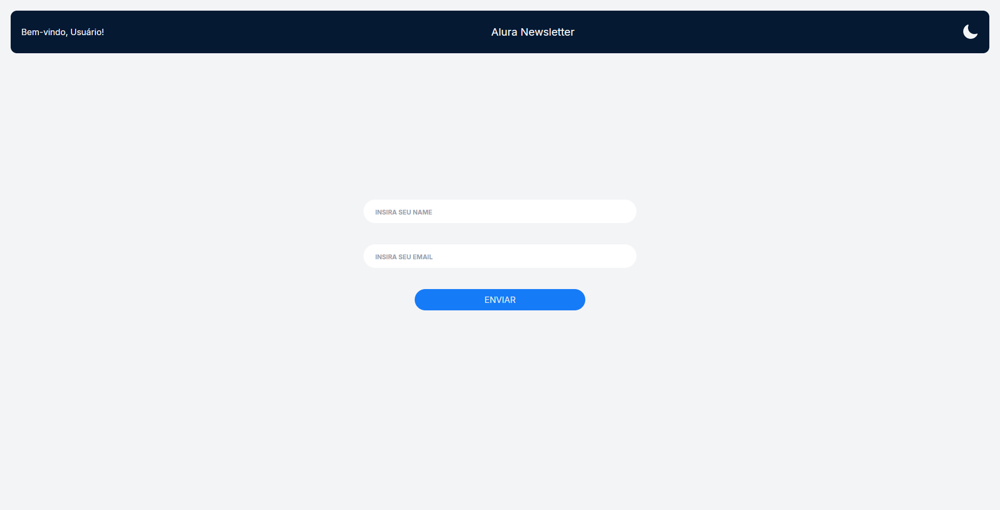

# React + TypeScript + Vite

This template provides a minimal setup to get React working in Vite with HMR and some ESLint rules.

Currently, two official plugins are available:

- [@vitejs/plugin-react](https://github.com/vitejs/vite-plugin-react/blob/main/packages/plugin-react/README.md) uses [Babel](https://babeljs.io/) for Fast Refresh
- [@vitejs/plugin-react-swc](https://github.com/vitejs/vite-plugin-react-swc) uses [SWC](https://swc.rs/) for Fast Refresh

## Expanding the ESLint configuration

If you are developing a production application, we recommend updating the configuration to enable type-aware lint rules:

```js
export default tseslint.config({
  extends: [
    // Remove ...tseslint.configs.recommended and replace with this
    ...tseslint.configs.recommendedTypeChecked,
    // Alternatively, use this for stricter rules
    ...tseslint.configs.strictTypeChecked,
    // Optionally, add this for stylistic rules
    ...tseslint.configs.stylisticTypeChecked,
  ],
  languageOptions: {
    // other options...
    parserOptions: {
      project: ["./tsconfig.node.json", "./tsconfig.app.json"],
      tsconfigRootDir: import.meta.dirname,
    },
  },
});
```

You can also install [eslint-plugin-react-x](https://github.com/Rel1cx/eslint-react/tree/main/packages/plugins/eslint-plugin-react-x) and [eslint-plugin-react-dom](https://github.com/Rel1cx/eslint-react/tree/main/packages/plugins/eslint-plugin-react-dom) for React-specific lint rules:

```js
// eslint.config.js
import reactX from "eslint-plugin-react-x";
import reactDom from "eslint-plugin-react-dom";

export default tseslint.config({
  plugins: {
    // Add the react-x and react-dom plugins
    "react-x": reactX,
    "react-dom": reactDom,
  },
  rules: {
    // other rules...
    // Enable its recommended typescript rules
    ...reactX.configs["recommended-typescript"].rules,
    ...reactDom.configs.recommended.rules,
  },
});
```

# Projeto Organo - Pessoas e Times - React.JS



## Menu

- [Layout](#layout)
- [Descrição](#descrição)
  - [Principais recursos incluem](#principais-recursos-incluem)
  - [Proximos passos de desenvolvimento](#proximos-passos-de-desenvolvimento)
- [Tecnologias Utilizadas](#tecnologias-utilizadas)
- [Estrutura de Pastas](#estrutura-de-pastas)
  - [Arquivos Principais](#arquivos-principais)
- [Como Instalar e Rodar o Projeto](#como-instalar-e-rodar-o-projeto)
  - [Configuração](#configuração)
  - [Casos de Uso Comuns](#casos-de-uso-comuns)
  - [Solução de Problemas](#solução-de-problemas)
- [Projeto ao Vivo](#projeto-ao-vivo)
- [Fluxo de Dados](#fluxo-de-dados)
- [Licença](#licença)
- [Autor](#autor)

## Layout

[Layout no Figma](<https://www.figma.com/design/THdd84v1UUyQpYj99c5XPf/React%253A-desenvolvendo-com-JavaScript-%7C-Organo-(Community)>)

## Descrição

### Principais recursos incluem:

### Proximos passos de desenvolvimento

## Tecnologias Utilizadas

## Estrutura de Pastas

### Arquivos Principais:

## Como Instalar e Rodar o Projeto

### Configuração

### Casos de Uso Comuns

### Solução de Problemas

## Projeto ao Vivo

Você pode ver o projeto ao vivo neste link: [Link para Vercel]()

## Fluxo de Dados

## Licença

Este projeto está licenciado sob a Licença MIT. Veja o arquivo [LICENSE](https://github.com/Melksedeque/alura-newsletter?tab=MIT-1-ov-file) para mais detalhes.

## Autor

- GitHub - [Melksedeque Silva](https://github.com/Melksedeque/)
- FrontEndMentor - [@Melksedeque](https://www.frontendmentor.io/profile/Melksedeque)
- Twitter / X - [@SouzaMelk](https://x.com/SouzaMelk)
- LinkedIn - [Melksedeque Silva](https://www.linkedin.com/in/melksedeque-silva/)
